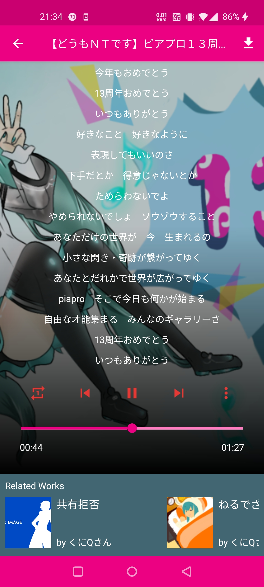

## Piaprobox

A simple third-party Android client for [piapro](https://piapro.jp).

Bring you more close to VOCALOID work submission news and deepen your love to VOCALOID characters!

**Piapro 13th Anniversary いつもありがとう！**

[Download](https://github.com/LinZong/Piaprobox/releases)

Some screenshots below:

**Piaprobox v1.0.2 includes some fixes. In most situations it can recreate homepage and music player even if you hit backs to launcher. But if you still survive issues like below, you may need to follow steps to grant permission manually.**

>**For user who is using newer version MIUI: MIUI denies "Display pop-up windows while running in the background" permission except some well-known apps in white list, which may forbid Piaprobox recreating homepage by pressing back button from music player sometimes. To avoid it happens, you may need to go to "App Info" -> "Permission" and grant it to Piaprobox. Piaprobox promises that this permission is only used to recreate homepage destroyed previously.**

